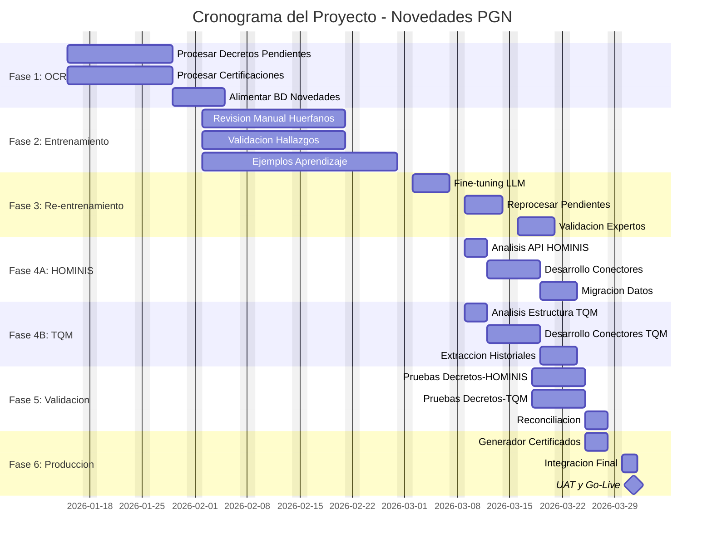

# INFORME EJECUTIVO
## Sistema de Novedades PGN con Integración HOMINIS + TQM

**Procuraduría General de la Nación**
**Fecha:** Enero 2026

---

## 1. RESUMEN DEL PROYECTO

### Objetivo
Implementar un sistema inteligente de gestión de novedades de personal que permita:
- Extraer automáticamente información de decretos y resoluciones mediante OCR e IA
- Consolidar datos de múltiples fuentes (Decretos, HOMINIS, TQM)
- Generar certificaciones de servicio de manera automatizada
- Consultar historiales laborales completos mediante un agente de IA

### Alcance
| Componente | Descripción |
|------------|-------------|
| **Procesamiento OCR** | 57,400 decretos (2009-2024) digitalizados con Azure Document Intelligence |
| **Extracción IA** | GPT-4o-mini para identificar novedades, funcionarios y cargos |
| **Base de Datos** | 61,000+ novedades de 13,100+ funcionarios |
| **Integración HOMINIS** | Funcionarios activos, nómina vigente, estructura actual |
| **Integración TQM** | Historiales completos, retirados, pensionados |
| **Salidas** | Certificaciones PDF, Agente RAG (Azure AI Search), Dashboard |

### Beneficios Esperados
| Antes | Después |
|-------|---------|
| Búsqueda manual en archivos físicos | Búsqueda instantánea por IA |
| Días para generar certificación | Certificación en minutos |
| Información fragmentada en 3 sistemas | Vista unificada del funcionario |
| Sin validación cruzada | Triple validación automática |

---

## 2. CRONOGRAMA DEL PROYECTO

| Campo | Valor |
|-------|-------|
| **Duración total** | 10.5 semanas (2 meses 15 días) |
| **Fecha de inicio** | 15 de Enero de 2026 |
| **Fecha de fin** | 31 de Marzo de 2026 |

---

## 3. DESCRIPCIÓN DE FASES

| Fase | Período | Duración | Descripción |
|------|---------|----------|-------------|
| **F1: Procesamiento OCR** | 15-30 Ene | 3 sem | Completar digitalización de decretos pendientes y certificaciones. Alimentar BD de novedades. |
| **F2: Entrenamiento** | 2-27 Feb | 4 sem | Revisión manual de decretos huérfanos, validación de hallazgos con expertos TH y jurídicos, acumulación de 500+ ejemplos para fine-tuning. |
| **F3: Re-entrenamiento** | 2-18 Mar | 2.5 sem | Fine-tuning del modelo LLM con ejemplos validados, reprocesar decretos pendientes, validación de accuracy >90%. |
| **F4A: HOMINIS** | 9-20 Mar | 2 sem | Análisis de API/BD HOMINIS, desarrollo de conectores REST, migración de datos de funcionarios activos. |
| **F4B: TQM** | 9-20 Mar | 2 sem | Análisis de estructura TQM (paralelo a HOMINIS), desarrollo de extractores, migración de historiales de retirados y pensionados. |
| **F5: Validación** | 18-27 Mar | 1.5 sem | Pruebas cruzadas triple fuente (Decretos-HOMINIS-TQM), reconciliación de datos, corrección de discrepancias. |
| **F6: Producción** | 25-31 Mar | 1 sem | Desarrollo del generador automático de certificados PDF, integración final, pruebas UAT y Go-Live. |

---

## 4. HITOS PRINCIPALES

| Fecha | Hito | Criterio de Éxito |
|-------|------|-------------------|
| 15 Ene | **Kick-off** | Equipo conformado |
| 30 Ene | **OCR Completo** | 100% decretos procesados |
| 6 Mar | **Modelo Entrenado** | 500+ ejemplos, accuracy >90% |
| 20 Mar | **Integración HOMINIS** | Datos sincronizados |
| 20 Mar | **Integración TQM** | Historiales migrados |
| 25 Mar | **Consolidación Triple** | Vista unificada funcionando |
| 27 Mar | **Pruebas Aprobadas** | 0 errores críticos |
| **31 Mar** | **GO-LIVE** | **Sistema en producción** |

---

## 5. ESTRATEGIA DE INTEGRACIÓN DUAL

### ¿Por qué dos sistemas?

| Sistema | Contenido | Uso Principal |
|---------|-----------|---------------|
| **HOMINIS** | Funcionarios activos, nómina vigente, estructura actual | Certificaciones de personal activo |
| **TQM** | Hojas de vida históricas, retirados, pensionados | Certificaciones de personal retirado y trayectorias completas |

### Matriz de Prioridad de Datos

| Tipo de Dato | TQM | HOMINIS | Fuente Prioritaria |
|--------------|-----|---------|-------------------|
| Funcionarios activos | Desactualizado | Vigente | **HOMINIS** |
| Funcionarios retirados | Completo | No disponible | **TQM** |
| Trayectoria pre-2015 | Completa | Parcial | **TQM** |
| Trayectoria post-2015 | Parcial | Completa | **HOMINIS** |
| Pensionados | Completo | No aplica | **TQM** |

---

## 6. ENTREGABLES FINALES

1. **Sistema de extracción OCR+IA** funcionando en producción
2. **Base de datos consolidada** con 61,000+ novedades validadas
3. **Conectores de integración** HOMINIS + TQM
4. **Generador automático de certificaciones** PDF
5. **Agente RAG** para consultas en lenguaje natural (Azure AI Search + GPT-4.1)
6. **Dashboard** de gestión y reportes

---

**Elaborado por:** Equipo de Proyecto Novedades PGN
**Fecha:** Enero 2026
**Versión:** 2.0
