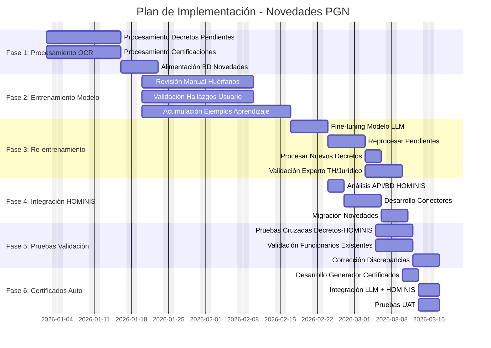
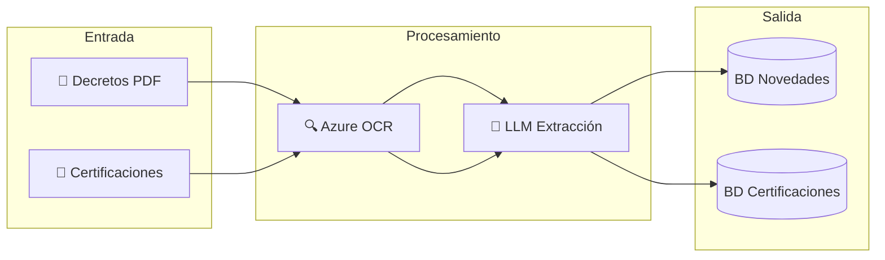
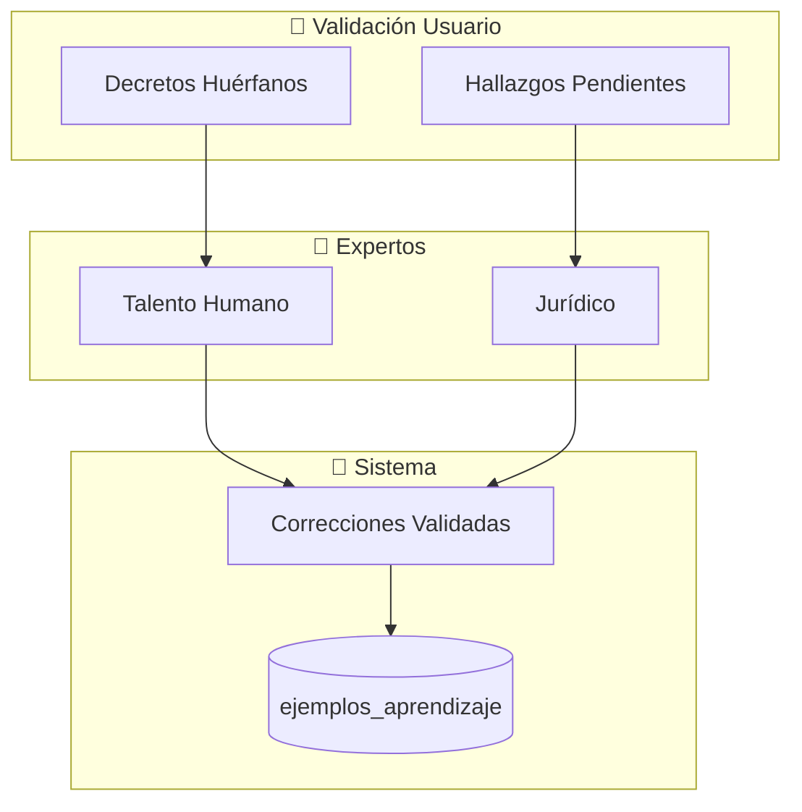
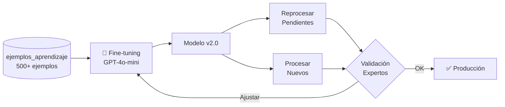
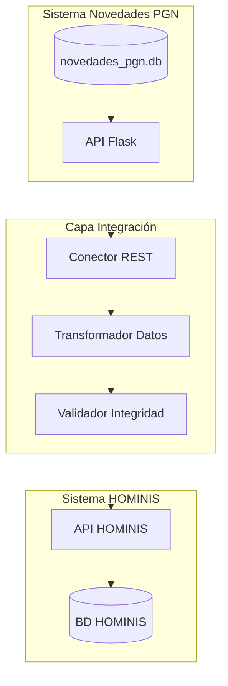
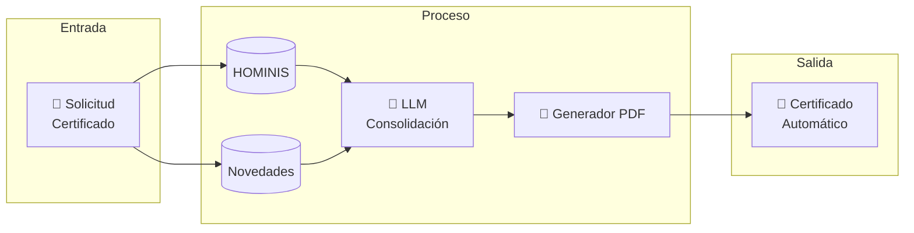
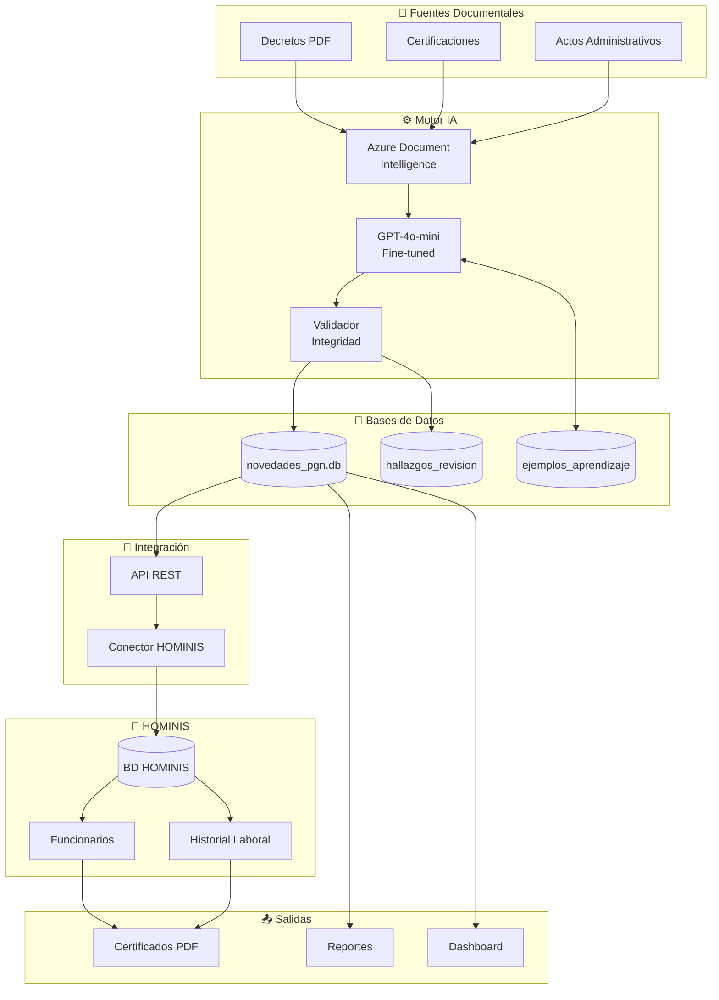

# Plan de Implementación del Proyecto
## Sistema de Novedades PGN con Integración HOMINIS

**Duración:** 2 meses 15 días (10.5 semanas)  
**Fecha Inicio:** 1 de Enero de 2026  
**Fecha Fin:** 15 de Marzo de 2026  
**Cliente:** Procuraduría General de la Nación

---

## Resumen Ejecutivo

Este plan establece la hoja de ruta para completar la implementación del sistema de extracción de novedades de decretos y certificaciones mediante OCR e IA, incluyendo el entrenamiento por refuerzo del modelo con validaciones de usuario, la integración con el sistema HOMINIS y la generación automática de certificados.

---

## Cronograma General



---

## Detalle de Fases

### FASE 1: Procesamiento OCR Completo
**Duración:** 3 semanas (2 - 17 Enero 2026)

| Actividad | Duración | Responsable | Entregable |
|-----------|----------|-------------|------------|
| Procesar decretos años faltantes | 10 días | Equipo Desarrollo | BD novedades actualizada |
| Procesar certificaciones actuales | 10 días | Equipo Desarrollo | Certificaciones digitalizadas |
| Alimentar BD novedades | 5 días | Equipo Desarrollo | Novedades vinculadas a decretos |



---

### FASE 2: Entrenamiento por Refuerzo
**Duración:** 4 semanas (20 Enero - 14 Febrero 2026)

| Actividad | Duración | Responsable | Entregable |
|-----------|----------|-------------|------------|
| Revisión decretos huérfanos | 15 días | Usuario + Experto TH | Correcciones validadas |
| Validación hallazgos discrepancias | 15 días | Usuario + Jurídico | Hallazgos resueltos |
| Acumulación ejemplos aprendizaje | 20 días | Sistema | Tabla ejemplos_aprendizaje poblada |

> [!IMPORTANT]
> **Recursos Requeridos:**
> - Experto en Talento Humano (Certificaciones)
> - Asesor Jurídico (Validación decretos)
> - Mínimo 500 ejemplos corregidos para fine-tuning efectivo



---

### FASE 3: Re-entrenamiento y Reprocesamiento
**Duración:** 2.5 semanas (17 Febrero - 5 Marzo 2026)

| Actividad | Duración | Responsable | Entregable |
|-----------|----------|-------------|------------|
| Fine-tuning modelo LLM | 5 días | Equipo IA | Modelo v2.0 optimizado |
| Reprocesar decretos pendientes | 5 días | Sistema | Pendientes clasificados |
| Procesar nuevos decretos | 3 días | Sistema | Decretos 2025-2026 procesados |
| Validación expertos | 5 días | Experto TH + Jurídico | Aprobación calidad |



---

### FASE 4: Integración con HOMINIS
**Duración:** 2 semanas (24 Febrero - 7 Marzo 2026)

| Actividad | Duración | Responsable | Entregable |
|-----------|----------|-------------|------------|
| Análisis API/BD HOMINIS | 3 días | Arquitecto + DBA | Documento integración |
| Desarrollo conectores | 5 días | Equipo Desarrollo | API REST conectores |
| Migración novedades | 3 días | DBA + Desarrollo | Novedades sincronizadas |



---

### FASE 5: Pruebas de Validación Cruzada
**Duración:** 1.5 semanas (5 - 12 Marzo 2026)

| Actividad | Duración | Responsable | Entregable |
|-----------|----------|-------------|------------|
| Pruebas cruzadas Decretos-HOMINIS | 5 días | QA + Experto TH | Reporte discrepancias |
| Validación funcionarios existentes | 5 días | QA + Jurídico | Lista funcionarios validados |
| Corrección discrepancias | 3 días | Desarrollo + DBA | Datos consistentes |

> [!WARNING]
> **Criterios de Aceptación:**
> - 100% cédulas coinciden entre decretos y HOMINIS
> - 95% nombres con coincidencia exacta o fuzzy >90%
> - 0 novedades huérfanas sin funcionario asociado

---

### FASE 6: Generación Automática de Certificados
**Duración:** 1 semana (10 - 15 Marzo 2026)

| Actividad | Duración | Responsable | Entregable |
|-----------|----------|-------------|------------|
| Desarrollo generador certificados | 3 días | Equipo Desarrollo | Módulo generación PDF |
| Integración LLM + HOMINIS | 2 días | Equipo IA | Pipeline automatizado |
| Pruebas UAT | 2 días | Usuario Final | Certificados aprobados |



---

## Arquitectura de Integración Final



---

## Recursos del Proyecto

| Rol | Dedicación | Fase Participación |
|-----|------------|-------------------|
| Líder de Proyecto | 100% | Todas |
| Desarrollador Backend | 100% | F1, F3, F4, F6 |
| Especialista IA/ML | 50% | F2, F3, F6 |
| DBA | 30% | F4, F5 |
| Experto Talento Humano | 50% | F2, F3, F5 |
| Asesor Jurídico | 30% | F2, F3, F5 |
| QA/Tester | 50% | F5, F6 |
| Usuario Funcional | 30% | F2, F5, F6 |

---

## Hitos del Proyecto

| Hito | Fecha | Criterio de Éxito |
|------|-------|-------------------|
| 🏁 **Kick-off** | 2 Enero 2026 | Equipo conformado |
| 📊 **OCR Completo** | 17 Enero 2026 | 100% decretos procesados |
| 🎓 **Modelo Entrenado** | 21 Febrero 2026 | 500+ ejemplos, accuracy >90% |
| 🔗 **Integración HOMINIS** | 7 Marzo 2026 | Datos sincronizados |
| ✅ **Pruebas Aprobadas** | 12 Marzo 2026 | 0 errores críticos |
| 🚀 **Go-Live** | 15 Marzo 2026 | Sistema en producción |

---

## Riesgos y Mitigación

| Riesgo | Probabilidad | Impacto | Mitigación |
|--------|-------------|---------|------------|
| Calidad OCR insuficiente | Media | Alto | Reprocesar con parámetros ajustados |
| Pocos ejemplos para fine-tuning | Media | Alto | Extender fase 2, priorizar revisión |
| API HOMINIS no disponible | Baja | Crítico | Plan B: integración por BD |
| Expertos no disponibles | Media | Alto | Programar sesiones anticipadas |

---

## Verificación del Plan

### Validación por Fase:
1. **F1:** Contar registros en BD novedades vs archivos origen
2. **F2:** Métricas de ejemplos_aprendizaje (count, distribución por código)
3. **F3:** Comparar accuracy antes/después fine-tuning
4. **F4:** Test conectividad API HOMINIS
5. **F5:** Reporte cruzado cédulas Decretos ↔ HOMINIS
6. **F6:** Generar 10 certificados de prueba, validación usuario

### Comando de Verificación Rápida:
```bash
# Verificar estado actual de la BD
sqlite3 novedades_pgn.db "
SELECT 'Decretos' as tipo, COUNT(*) as total FROM decretos
UNION ALL SELECT 'Novedades', COUNT(*) FROM novedades
UNION ALL SELECT 'Funcionarios', COUNT(*) FROM funcionarios
UNION ALL SELECT 'Ejemplos Aprendizaje', COUNT(*) FROM ejemplos_aprendizaje
UNION ALL SELECT 'Hallazgos Pendientes', COUNT(*) FROM hallazgos_revision WHERE estado='PENDIENTE';
"
```

---

> [!NOTE]
> Este plan está sujeto a ajustes según disponibilidad de recursos y prioridades institucionales. Se recomienda revisión semanal de avance con el comité de proyecto.
