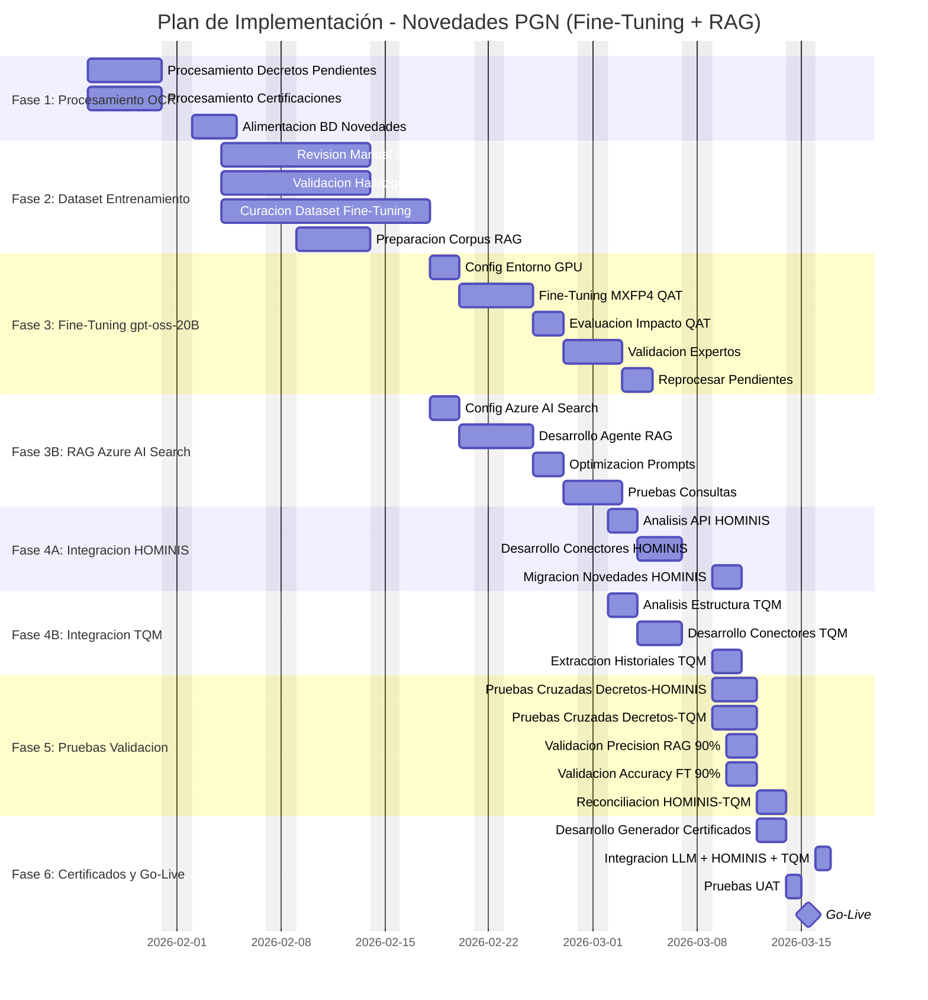
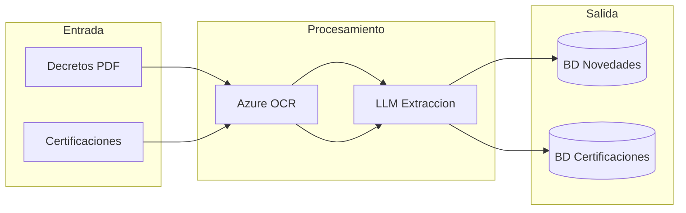
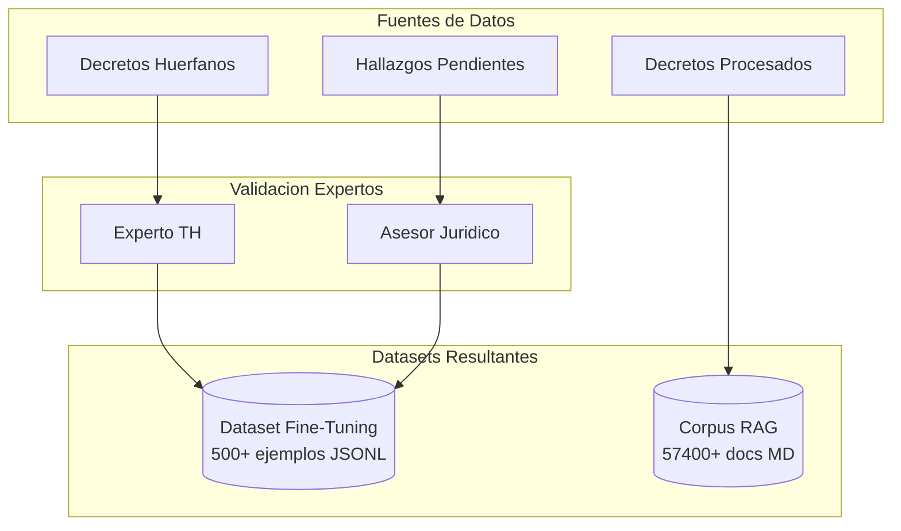
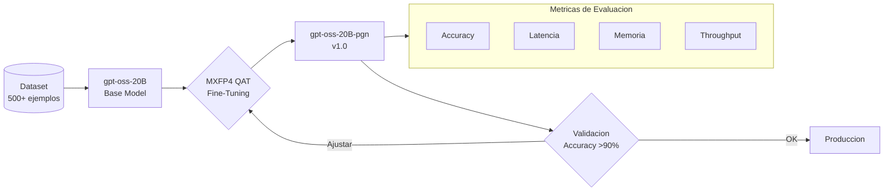
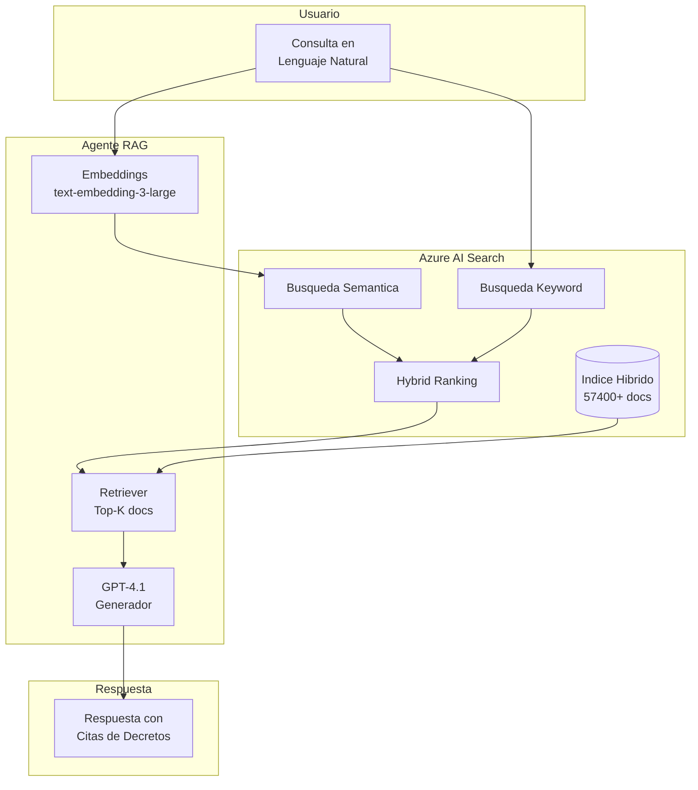
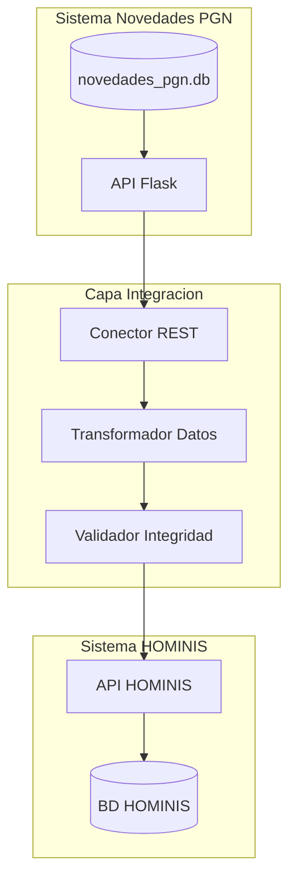
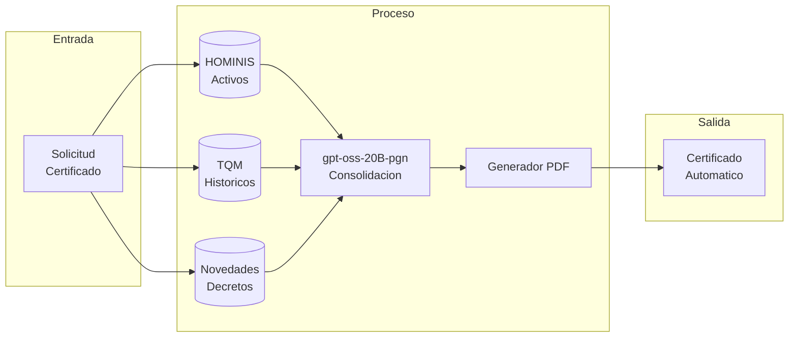
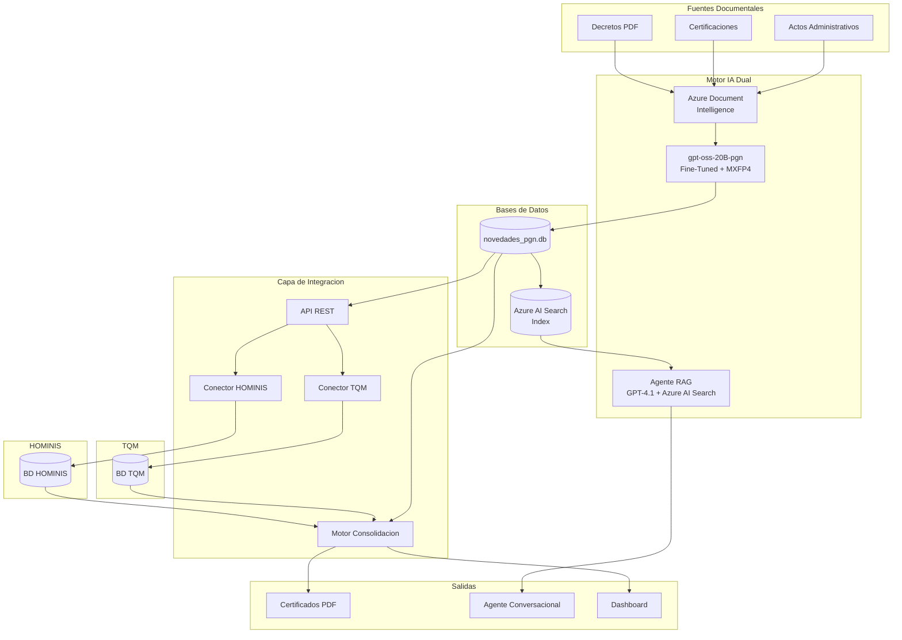

# Plan de Implementación del Proyecto
## Sistema de Novedades PGN con Integración HOMINIS + TQM
## Entrenamiento Dual: Fine-Tuning gpt-oss-20B + RAG con Azure AI Search

**Duración:** 7 semanas
**Fecha Inicio:** 26 de Enero de 2026
**Fecha Fin:** 15 de Marzo de 2026
**Cliente:** Procuraduría General de la Nación

---

## Resumen Ejecutivo

Este plan establece la hoja de ruta para completar la implementación del sistema de extracción de novedades de decretos y certificaciones mediante OCR e IA, incluyendo:

1. **Fine-Tuning del modelo gpt-oss-20B** con Quantization Aware Training (MXFP4 QAT) para optimizar accuracy y rendimiento
2. **Implementación de RAG** (Retrieval Augmented Generation) con Azure AI Search para búsquedas semánticas con precisión >90%
3. **Integración dual** con sistemas HOMINIS y TQM
4. **Generación automática de certificados**

### Estrategia de Entrenamiento Dual

| Componente | Tecnología | Objetivo | Métrica de Éxito |
|------------|------------|----------|------------------|
| **Fine-Tuning** | gpt-oss-20B + MXFP4 QAT | Extracción precisa de novedades de decretos | Accuracy >90% en clasificación |
| **RAG** | Azure AI Search + GPT-4.1 | Consultas en lenguaje natural sobre historiales | Precisión búsqueda >90% |

### Sistemas a Integrar

| Sistema | Descripción | Datos Clave |
|---------|-------------|-------------|
| **HOMINIS** | Sistema actual de nómina y gestión humana | Funcionarios activos, cargos, dependencias, novedades vigentes |
| **TQM** | Repositorio histórico de hojas de vida | Historiales laborales, documentos escaneados, trayectorias completas |

> [!NOTE]
> **TQM** contiene información histórica de funcionarios que ya no están en HOMINIS (retirados, pensionados, fallecidos). La integración dual permite reconstruir trayectorias completas desde el ingreso hasta el retiro.

---

## Tabla de Cotización del Proyecto

### Cotización de Servicios Profesionales

| # | Actividad | Producto/Entregable | Recursos Requeridos | Valor | IVA (19%) | Total |
|---|-----------|---------------------|---------------------|------:|----------:|------:|
| **FASE 1: Procesamiento OCR** ||||||
| 1.1 | Procesamiento de decretos pendientes (2009-2024) | BD novedades con 57,400+ registros procesados | Desarrollador Backend, Azure Document Intelligence | $8,500,000 | $1,615,000 | $10,115,000 |
| 1.2 | Procesamiento de certificaciones actuales | Certificaciones digitalizadas y estructuradas | Desarrollador Backend, Azure OCR | $6,500,000 | $1,235,000 | $7,735,000 |
| 1.3 | Alimentación y normalización BD novedades | Novedades vinculadas a decretos fuente | Desarrollador Backend, DBA | $4,000,000 | $760,000 | $4,760,000 |
| | **Subtotal Fase 1** | | | **$19,000,000** | **$3,610,000** | **$22,610,000** |
| **FASE 2: Preparación Dataset para Entrenamiento** ||||||
| 2.1 | Revisión manual de decretos huérfanos | Correcciones validadas por expertos | Experto TH, Asesor Jurídico, Ingeniero IA | $12,000,000 | $2,280,000 | $14,280,000 |
| 2.2 | Validación de hallazgos y discrepancias | Hallazgos resueltos y documentados | Experto TH, Asesor Jurídico | $8,000,000 | $1,520,000 | $9,520,000 |
| 2.3 | Curación de dataset para Fine-Tuning | Dataset de 500+ ejemplos etiquetados (JSONL) | Ingeniero IA, Experto TH | $15,000,000 | $2,850,000 | $17,850,000 |
| 2.4 | Preparación corpus para RAG | Documentos MD indexados en Azure AI Search | Ingeniero IA, Desarrollador Backend | $10,000,000 | $1,900,000 | $11,900,000 |
| | **Subtotal Fase 2** | | | **$45,000,000** | **$8,550,000** | **$53,550,000** |
| **FASE 3: Fine-Tuning gpt-oss-20B con MXFP4 QAT** ||||||
| 3.1 | Configuración entorno de entrenamiento GPU | Infraestructura GPU configurada (Azure ML) | Ingeniero IA, DevOps | $8,000,000 | $1,520,000 | $9,520,000 |
| 3.2 | Fine-Tuning gpt-oss-20B for Accuracy and Performance with Quantization Aware Training | Modelo gpt-oss-20B-pgn-v1.0 optimizado | Ingeniero IA | $25,000,000 | $4,750,000 | $29,750,000 |
| 3.3 | Evaluación de impacto MXFP4 QAT (Impact of MXFP4 QAT fine-tuning on gpt-oss) | Reporte de métricas: accuracy, latencia, memoria | Ingeniero IA | $10,000,000 | $1,900,000 | $11,900,000 |
| 3.4 | Validación con expertos de dominio | Aprobación de calidad (accuracy >90%) | Ingeniero IA, Experto TH, Jurídico | $6,000,000 | $1,140,000 | $7,140,000 |
| 3.5 | Reprocesamiento de decretos pendientes | Decretos reclasificados con modelo optimizado | Ingeniero IA | $5,000,000 | $950,000 | $5,950,000 |
| | **Subtotal Fase 3** | | | **$54,000,000** | **$10,260,000** | **$64,260,000** |
| **FASE 3B: Implementación RAG con Azure AI Search** ||||||
| 3B.1 | Configuración Azure AI Search (índice híbrido + semántico) | Índice semántico con 57,400+ documentos | Ingeniero IA, Arquitecto Cloud | $12,000,000 | $2,280,000 | $14,280,000 |
| 3B.2 | Desarrollo agente RAG con GPT-4.1 | Agente funcional para consultas en lenguaje natural | Ingeniero IA, Desarrollador Backend | $18,000,000 | $3,420,000 | $21,420,000 |
| 3B.3 | Optimización de prompts y retrieval | Precisión de búsqueda >90% validada | Ingeniero IA | $8,000,000 | $1,520,000 | $9,520,000 |
| 3B.4 | Pruebas de consultas con funcionarios reales | Reporte de 10 consultas de prueba validadas | Ingeniero IA, QA | $4,000,000 | $760,000 | $4,760,000 |
| | **Subtotal Fase 3B** | | | **$42,000,000** | **$7,980,000** | **$49,980,000** |
| **FASE 4A: Integración HOMINIS** ||||||
| 4A.1 | Análisis de API/BD HOMINIS | Documento de integración y mapeo de datos | Arquitecto, DBA | $5,000,000 | $950,000 | $5,950,000 |
| 4A.2 | Desarrollo de conectores HOMINIS | API REST de conectores funcionando | Desarrollador Backend | $8,000,000 | $1,520,000 | $9,520,000 |
| 4A.3 | Migración de novedades desde HOMINIS | Novedades de funcionarios activos sincronizadas | DBA, Desarrollador Backend | $5,000,000 | $950,000 | $5,950,000 |
| | **Subtotal Fase 4A** | | | **$18,000,000** | **$3,420,000** | **$21,420,000** |
| **FASE 4B: Integración TQM** ||||||
| 4B.1 | Análisis de estructura TQM | Mapeo de datos y esquema documentado | Arquitecto, DBA | $5,000,000 | $950,000 | $5,950,000 |
| 4B.2 | Desarrollo de conectores TQM | Extractor TQM funcionando | Desarrollador Backend | $8,000,000 | $1,520,000 | $9,520,000 |
| 4B.3 | Extracción de historiales TQM | Historiales de retirados/pensionados migrados | DBA, Desarrollador Backend | $5,000,000 | $950,000 | $5,950,000 |
| | **Subtotal Fase 4B** | | | **$18,000,000** | **$3,420,000** | **$21,420,000** |
| **FASE 5: Pruebas de Validación Cruzada** ||||||
| 5.1 | Pruebas cruzadas Decretos-HOMINIS | Reporte de discrepancias HOMINIS | QA, Experto TH | $4,000,000 | $760,000 | $4,760,000 |
| 5.2 | Pruebas cruzadas Decretos-TQM | Reporte de discrepancias TQM | QA, Experto TH | $4,000,000 | $760,000 | $4,760,000 |
| 5.3 | Reconciliación HOMINIS-TQM | Mapeo unificado de funcionarios | DBA, Desarrollador | $3,000,000 | $570,000 | $3,570,000 |
| 5.4 | Validación de precisión RAG (>90%) | Reporte de precisión >90% en búsquedas | Ingeniero IA, QA | $5,000,000 | $950,000 | $5,950,000 |
| 5.5 | Validación de accuracy Fine-Tuning (>90%) | Reporte de accuracy >90% en clasificación | Ingeniero IA, QA | $5,000,000 | $950,000 | $5,950,000 |
| | **Subtotal Fase 5** | | | **$21,000,000** | **$3,990,000** | **$24,990,000** |
| **FASE 6: Generación Automática de Certificados** ||||||
| 6.1 | Desarrollo generador de certificados PDF | Módulo de generación PDF automatizado | Desarrollador Backend | $8,000,000 | $1,520,000 | $9,520,000 |
| 6.2 | Integración LLM + HOMINIS + TQM | Pipeline de certificación end-to-end | Ingeniero IA, Desarrollador | $10,000,000 | $1,900,000 | $11,900,000 |
| 6.3 | Pruebas UAT | Certificados aprobados por usuario final | QA, Usuario Final | $3,000,000 | $570,000 | $3,570,000 |
| 6.4 | Despliegue a producción (Go-Live) | Sistema en producción | DevOps, Líder Proyecto | $4,000,000 | $760,000 | $4,760,000 |
| | **Subtotal Fase 6** | | | **$25,000,000** | **$4,750,000** | **$29,750,000** |

### Resumen de Cotización

| Fase | Descripción | Valor | IVA (19%) | Total |
|------|-------------|------:|----------:|------:|
| F1 | Procesamiento OCR | $19,000,000 | $3,610,000 | $22,610,000 |
| F2 | Preparación Dataset para Entrenamiento | $45,000,000 | $8,550,000 | $53,550,000 |
| F3 | Fine-Tuning gpt-oss-20B con MXFP4 QAT | $54,000,000 | $10,260,000 | $64,260,000 |
| F3B | Implementación RAG con Azure AI Search | $42,000,000 | $7,980,000 | $49,980,000 |
| F4A | Integración HOMINIS | $18,000,000 | $3,420,000 | $21,420,000 |
| F4B | Integración TQM | $18,000,000 | $3,420,000 | $21,420,000 |
| F5 | Pruebas de Validación Cruzada | $21,000,000 | $3,990,000 | $24,990,000 |
| F6 | Generación Automática de Certificados | $25,000,000 | $4,750,000 | $29,750,000 |
| | **TOTAL PROYECTO** | **$242,000,000** | **$45,980,000** | **$287,980,000** |

> [!NOTE]
> **Notas de la Cotización:**
> - Valores expresados en Pesos Colombianos (COP)
> - IVA del 19% aplicado según normativa vigente
> - No incluye costos de infraestructura cloud (Azure) que serán facturados por consumo
> - Validez de la cotización: 30 días calendario
> - Forma de pago: 30% anticipo, 40% avance, 30% entrega final

---

## Cronograma General



---

## Detalle de Fases

### FASE 1: Procesamiento OCR Completo
**Duración:** 1.5 semanas (26 Enero - 5 Febrero 2026)

| Actividad | Duración | Responsable | Entregable |
|-----------|----------|-------------|------------|
| Procesar decretos años faltantes | 10 días | Equipo Desarrollo | BD novedades actualizada |
| Procesar certificaciones actuales | 10 días | Equipo Desarrollo | Certificaciones digitalizadas |
| Alimentar BD novedades | 5 días | Equipo Desarrollo | Novedades vinculadas a decretos |



---

### FASE 2: Preparación de Dataset para Entrenamiento
**Duración:** 2 semanas (4 Febrero - 17 Febrero 2026)

| Actividad | Duración | Responsable | Entregable |
|-----------|----------|-------------|------------|
| Revisión decretos huérfanos | 15 días | Usuario + Experto TH | Correcciones validadas |
| Validación hallazgos discrepancias | 15 días | Usuario + Jurídico | Hallazgos resueltos |
| Curación dataset Fine-Tuning | 20 días | Ingeniero IA | Dataset JSONL 500+ ejemplos |
| Preparación corpus RAG | 10 días | Ingeniero IA | Documentos MD indexados |

> [!IMPORTANT]
> **Objetivos de Dataset:**
> - **Fine-Tuning:** Mínimo 500 ejemplos etiquetados en formato JSONL para entrenamiento supervisado
> - **RAG:** 57,400+ documentos MD indexados en Azure AI Search con chunking de 1024 tokens



---

### FASE 3: Fine-Tuning gpt-oss-20B con MXFP4 QAT
**Duración:** 2 semanas (18 Febrero - 1 Marzo 2026)

#### Objetivo
Fine-Tuning del modelo **gpt-oss-20B** para mejorar accuracy y rendimiento mediante **Quantization Aware Training (QAT)** con formato **MXFP4**.

| Actividad | Duración | Responsable | Entregable |
|-----------|----------|-------------|------------|
| Configuración entorno GPU | 2 días | Ingeniero IA + DevOps | Infraestructura lista |
| Fine-Tuning gpt-oss-20B con MXFP4 QAT | 5 días | Ingeniero IA | Modelo gpt-oss-20B-pgn-v1.0 |
| Evaluación impacto MXFP4 QAT | 2 días | Ingeniero IA | Reporte de métricas |
| Validación expertos | 3 días | Experto TH + Jurídico | Aprobación calidad |
| Reprocesar decretos pendientes | 3 días | Sistema | Pendientes clasificados |

#### Métricas de Impacto MXFP4 QAT

| Métrica | Baseline (FP16) | Target (MXFP4 QAT) | Impacto Esperado |
|---------|-----------------|--------------------|--------------------|
| **Accuracy** | 85% | >90% | +5% mejora |
| **Latencia inferencia** | 150ms | <100ms | -33% reducción |
| **Memoria GPU** | 40GB | <20GB | -50% reducción |
| **Throughput** | 50 req/s | >80 req/s | +60% mejora |



#### Configuración de Entrenamiento gpt-oss-20B

```yaml
# training_config.yaml
model:
  base: gpt-oss-20B
  output: gpt-oss-20B-pgn-v1.0

quantization:
  method: MXFP4_QAT
  precision: mixed
  calibration_samples: 1000

training:
  epochs: 3
  batch_size: 8
  learning_rate: 2e-5
  warmup_steps: 100
  gradient_accumulation: 4

dataset:
  train: ejemplos_aprendizaje_train.jsonl
  eval: ejemplos_aprendizaje_eval.jsonl
  split: 0.9/0.1

evaluation:
  metrics:
    - accuracy
    - f1_score
    - latency_p95
    - memory_usage
  threshold_accuracy: 0.90
```

---

### FASE 3B: Implementación RAG con Azure AI Search
**Duración:** 2 semanas (18 Febrero - 1 Marzo 2026) - Paralelo a Fine-Tuning

#### Objetivo
Implementar sistema RAG con Azure AI Search para consultas en lenguaje natural con precisión de búsqueda >90%.

| Actividad | Duración | Responsable | Entregable |
|-----------|----------|-------------|------------|
| Configuración Azure AI Search | 3 días | Ingeniero IA + Arquitecto | Índice híbrido configurado |
| Desarrollo agente RAG | 5 días | Ingeniero IA | Agente GPT-4.1 funcional |
| Optimización prompts y retrieval | 3 días | Ingeniero IA | Precisión >90% |
| Pruebas de consultas | 2 días | Ingeniero IA + QA | Reporte de validación |

#### Arquitectura RAG



#### Configuración Azure AI Search

| Parámetro | Valor |
|-----------|-------|
| **Tipo de índice** | Híbrido (Keyword + Semántico) |
| **Modelo embeddings** | text-embedding-3-large (3072 dims) |
| **Chunk size** | 1024 tokens |
| **Chunk overlap** | 128 tokens |
| **Semantic ranker** | Habilitado |
| **Top-K retrieval** | 10 documentos |

#### Métricas de Precisión RAG

| Métrica | Target | Método de Medición |
|---------|--------|-------------------|
| **Precision@10** | >90% | Documentos relevantes en top-10 |
| **Recall** | >85% | Cobertura de información requerida |
| **MRR** | >0.8 | Mean Reciprocal Rank |
| **Latencia E2E** | <3s | Tiempo total query-to-response |

---

### FASE 4A: Integración con HOMINIS
**Duración:** 1 semana (2 Marzo - 8 Marzo 2026)

| Actividad | Duración | Responsable | Entregable |
|-----------|----------|-------------|------------|
| Análisis API/BD HOMINIS | 3 días | Arquitecto + DBA | Documento integración |
| Desarrollo conectores HOMINIS | 5 días | Equipo Desarrollo | API REST conectores |
| Migración novedades | 3 días | DBA + Desarrollo | Novedades sincronizadas |

**Datos a obtener de HOMINIS:**
- Funcionarios activos (cédula, nombre, cargo actual)
- Dependencias y estructura organizacional actual
- Novedades de nómina vigentes
- Códigos de cargo y grados salariales



---

### FASE 4B: Integración con TQM (Paralelo)
**Duración:** 1 semana (2 Marzo - 8 Marzo 2026)

| Actividad | Duración | Responsable | Entregable |
|-----------|----------|-------------|------------|
| Análisis estructura TQM | 3 días | Arquitecto + DBA | Mapeo de datos TQM |
| Desarrollo conectores TQM | 5 días | Equipo Desarrollo | Extractor TQM |
| Extracción historiales | 3 días | DBA + Desarrollo | Historiales migrados |

**Datos a obtener de TQM:**
- Hojas de vida históricas (funcionarios retirados)
- Trayectorias laborales completas
- Documentos escaneados de soportes
- Historiales de cargos anteriores a HOMINIS
- Información de pensionados y fallecidos

> [!IMPORTANT]
> **TQM** es el sistema legado de repositorio de hojas de vida. Contiene información histórica que NO está en HOMINIS, especialmente de funcionarios que se retiraron antes de la migración al nuevo sistema.

### Matriz de Datos: TQM vs HOMINIS

| Campo | TQM | HOMINIS | Prioridad |
|-------|-----|---------|-----------|
| Funcionarios activos | Desactualizado | Fuente primaria | HOMINIS |
| Funcionarios retirados | Histórico completo | No disponible | TQM |
| Trayectoria laboral pre-2015 | Completa | Parcial | TQM |
| Trayectoria laboral post-2015 | Parcial | Completa | HOMINIS |
| Documentos soporte | Escaneados | No disponible | TQM |
| Cargos y grados actuales | Desactualizado | Vigente | HOMINIS |
| Pensionados | Completo | No aplica | TQM |

---

### FASE 5: Pruebas de Validación Cruzada (Triple Fuente)
**Duración:** 1 semana (9 Marzo - 13 Marzo 2026)

| Actividad | Duración | Responsable | Entregable |
|-----------|----------|-------------|------------|
| Pruebas cruzadas Decretos-HOMINIS | 5 días | QA + Experto TH | Reporte discrepancias HOMINIS |
| Pruebas cruzadas Decretos-TQM | 5 días | QA + Experto TH | Reporte discrepancias TQM |
| Validación precisión RAG | 3 días | Ingeniero IA + QA | Precisión >90% validada |
| Validación accuracy Fine-Tuning | 3 días | Ingeniero IA + QA | Accuracy >90% validada |
| Reconciliación HOMINIS-TQM | 3 días | DBA + Desarrollo | Mapeo unificado funcionarios |

> [!WARNING]
> **Criterios de Aceptación:**
> - 100% cédulas coinciden entre decretos y HOMINIS (funcionarios activos)
> - 100% cédulas coinciden entre decretos y TQM (funcionarios retirados)
> - **Precisión RAG >90%** en consultas de búsqueda
> - **Accuracy Fine-Tuning >90%** en clasificación de novedades
> - 0 novedades huérfanas sin funcionario asociado

### Matriz de Validación Dual (Fine-Tuning + RAG)

| Componente | Métrica | Target | Método de Validación |
|------------|---------|--------|---------------------|
| **Fine-Tuning gpt-oss-20B** | Accuracy | >90% | Test set 10% holdout |
| **Fine-Tuning gpt-oss-20B** | F1-Score | >0.88 | Promedio macro todas las clases |
| **RAG Azure AI Search** | Precision@10 | >90% | 100 consultas de prueba |
| **RAG Azure AI Search** | Latencia E2E | <3s | P95 percentil |
| **Sistema Integrado** | Certificaciones correctas | >95% | Muestra 50 certificados |

---

### FASE 6: Generación Automática de Certificados
**Duración:** 3 días (12 - 15 Marzo 2026)

| Actividad | Duración | Responsable | Entregable |
|-----------|----------|-------------|------------|
| Desarrollo generador certificados | 3 días | Equipo Desarrollo | Módulo generación PDF |
| Integración LLM + HOMINIS + TQM | 2 días | Ingeniero IA | Pipeline automatizado |
| Pruebas UAT | 2 días | Usuario Final | Certificados aprobados |



---

## Recursos del Proyecto

| Rol | Dedicación | Fase Participación | Responsabilidades |
|-----|------------|-------------------|-------------------|
| Líder de Proyecto | 100% | Todas | Gestión, seguimiento, reportes |
| Desarrollador Backend | 100% | F1, F4, F6 | APIs, conectores, generador PDF |
| **Ingeniero IA** | **100%** | **F2, F3, F3B, F5** | **Fine-Tuning gpt-oss-20B, RAG, QAT** |
| DBA | 30% | F4, F5 | BD, migraciones, integraciones |
| Experto Talento Humano | 50% | F2, F3, F5 | Validación, etiquetado dataset |
| Asesor Jurídico | 30% | F2, F3, F5 | Validación decretos |
| QA/Tester | 50% | F5, F6 | Pruebas, validación métricas |
| DevOps/Arquitecto Cloud | 30% | F3, F3B | Infraestructura GPU, Azure AI Search |
| Usuario Funcional | 30% | F2, F5, F6 | UAT, validación certificados |

### Perfil Ingeniero IA (Detalle)

| Aspecto | Descripción |
|---------|-------------|
| **Rol** | Ingeniero de Inteligencia Artificial Senior |
| **Dedicación** | 100% (tiempo completo durante el proyecto) |
| **Objetivo Principal** | Obtener datasets de entrenamiento para Fine-Tuning del modelo LLM gpt-oss-20B |
| **Actividad Principal** | Fine-Tuning gpt-oss-20B for Accuracy and Performance with Quantization Aware Training |
| **Medición de Impacto** | Impact of MXFP4 QAT fine-tuning on gpt-oss - Métricas de accuracy, latencia, memoria |
| **Entregables** | Modelo gpt-oss-20B-pgn-v1.0, Agente RAG, Reportes de métricas |

#### Competencias Requeridas Ingeniero IA

| Competencia | Nivel | Aplicación |
|-------------|-------|------------|
| Fine-Tuning LLMs | Avanzado | Entrenamiento supervisado gpt-oss-20B |
| Quantization Aware Training | Avanzado | Implementación MXFP4 QAT |
| Azure AI Search | Intermedio-Avanzado | Configuración índices híbridos |
| RAG (Retrieval Augmented Generation) | Avanzado | Diseño y optimización agente |
| Python/PyTorch | Avanzado | Scripts de entrenamiento y evaluación |
| MLOps | Intermedio | Despliegue y monitoreo de modelos |
| Evaluación de modelos NLP | Avanzado | Métricas accuracy, F1, precisión |

---

## Hitos del Proyecto

| Hito | Fecha | Criterio de Éxito |
|------|-------|-------------------|
| Kick-off | 26 Enero 2026 | Equipo conformado |
| OCR Completo | 5 Febrero 2026 | 100% decretos procesados |
| Dataset Fine-Tuning Listo | 17 Febrero 2026 | 500+ ejemplos JSONL validados |
| **Fine-Tuning gpt-oss-20B Completo** | 1 Marzo 2026 | **Accuracy >90% validado** |
| **RAG Operativo** | 1 Marzo 2026 | **Precisión búsqueda >90%** |
| Integración HOMINIS | 8 Marzo 2026 | Datos HOMINIS sincronizados |
| Integración TQM | 8 Marzo 2026 | Historiales TQM migrados |
| Pruebas Aprobadas | 13 Marzo 2026 | 0 errores críticos |
| **Go-Live** | **15 Marzo 2026** | **Sistema en producción** |

---

## Riesgos y Mitigación

| Riesgo | Probabilidad | Impacto | Mitigación |
|--------|-------------|---------|------------|
| Calidad OCR insuficiente | Media | Alto | Reprocesar con parámetros ajustados |
| Pocos ejemplos para fine-tuning | Media | Alto | Extender fase 2, priorizar revisión |
| **Degradación accuracy con MXFP4** | Media | Alto | Calibración cuidadosa, fallback a FP16 |
| **Precisión RAG <90%** | Media | Alto | Optimizar prompts, ajustar top-K |
| API HOMINIS no disponible | Baja | Crítico | Plan B: integración por BD directa |
| TQM estructura desconocida | Media | Alto | Análisis exploratorio previo |
| **Recursos GPU insuficientes** | Media | Alto | Usar Azure ML o cloud GPU on-demand |
| Datos TQM inconsistentes | Alta | Medio | Normalización y limpieza en ETL |
| Expertos no disponibles | Media | Alto | Programar sesiones anticipadas |

---

## Arquitectura Final del Sistema



---

## Glosario

| Término | Definición |
|---------|------------|
| **gpt-oss-20B** | Modelo de lenguaje open-source de 20 billones de parámetros base para fine-tuning |
| **MXFP4 QAT** | Quantization Aware Training con formato Mixed Precision FP4 para optimizar rendimiento |
| **Fine-Tuning** | Entrenamiento supervisado del modelo con datos específicos del dominio (novedades PGN) |
| **RAG** | Retrieval Augmented Generation - Técnica que combina búsqueda con generación de texto |
| **Azure AI Search** | Servicio de Microsoft para búsqueda semántica e híbrida |
| **HOMINIS** | Sistema de información de nómina y gestión humana actualmente en uso |
| **TQM** | Total Quality Management - Sistema legado de repositorio de hojas de vida |
| **Precisión >90%** | Métrica objetivo para búsquedas RAG (documentos relevantes en top-10) |
| **Accuracy >90%** | Métrica objetivo para clasificación de novedades con modelo fine-tuned |

---

> [!NOTE]
> Este plan está sujeto a ajustes según disponibilidad de recursos y prioridades institucionales. Se recomienda revisión semanal de avance con el comité de proyecto.

> [!IMPORTANT]
> El proyecto implementa una estrategia de **entrenamiento dual**:
> 1. **Fine-Tuning gpt-oss-20B con MXFP4 QAT** para extracción precisa de novedades (accuracy >90%)
> 2. **RAG con Azure AI Search** para consultas en lenguaje natural (precisión >90%)
